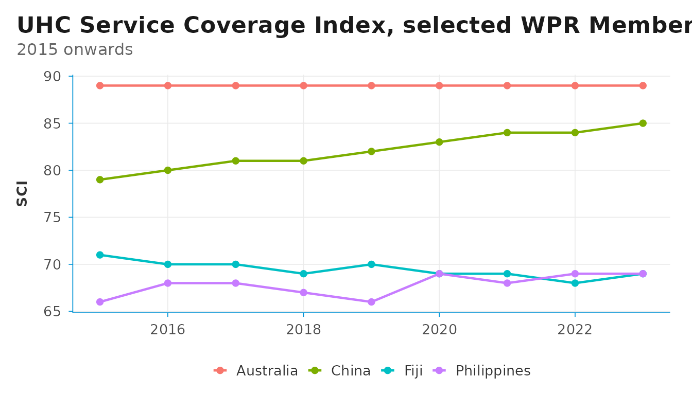
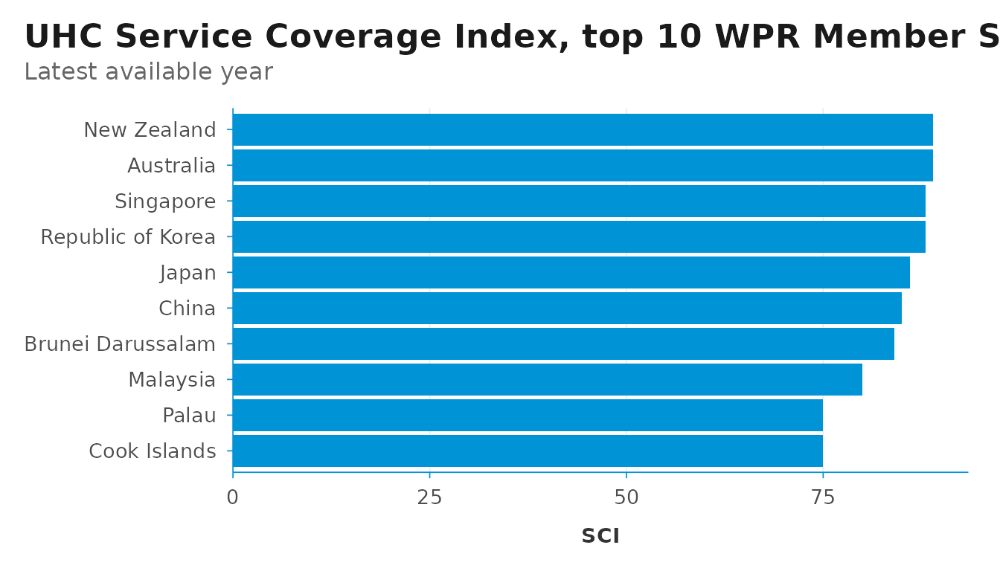
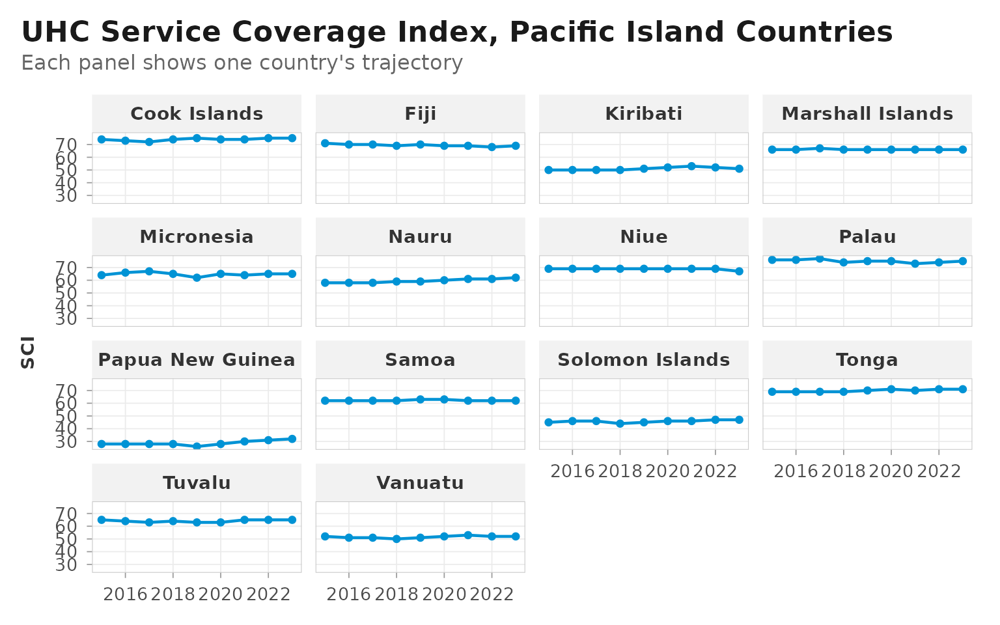
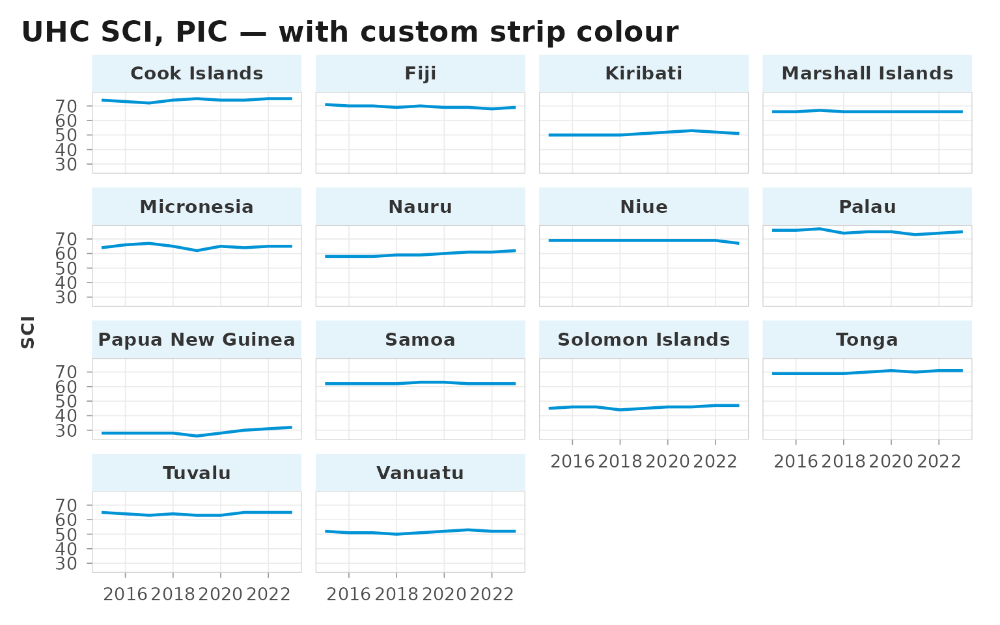

# DSIR

``` r

library(DSIR)
library(dplyr)
#> 
#> Attaching package: 'dplyr'
#> The following objects are masked from 'package:stats':
#> 
#>     filter, lag
#> The following objects are masked from 'package:base':
#> 
#>     intersect, setdiff, setequal, union
library(ggplot2)
```


DSIR is a small R package for global health data work. It consists of
WHO Member State metadata, lightweight clients for the GHO and UN SDG
APIs, and reusable WHO-style `ggplot2` and `flextable` themes. DSIR is
designed for health professionals, WHO staff, and global health
researchers — the kind of users who do the same routine tasks every day.

This vignette walks through the typical workflow: looking up countries,
fetching data from GHO and SDG, cleaning the raw response, and producing
publication-style charts and tables.

## WHO Member State metadata

The `who_countries` tibble lists all 194 WHO Member States with their
ISO3, ISO2, UN M49 codes, official names, short names, and WHO region.
For Western Pacific countries, an extra column `is_pic` identifies the
14 Pacific Island Countries.

``` r

who_countries
#> # A tibble: 194 × 7
#>    iso3  iso2  m49_code name_official       name_short         who_region is_pic
#>    <chr> <chr> <chr>    <chr>               <chr>              <chr>      <lgl> 
#>  1 AFG   AF    004      Afghanistan         Afghanistan        EMR        FALSE 
#>  2 ALB   AL    008      Albania             Albania            EUR        FALSE 
#>  3 DZA   DZ    012      Algeria             Algeria            AFR        FALSE 
#>  4 AND   AD    020      Andorra             Andorra            EUR        FALSE 
#>  5 AGO   AO    024      Angola              Angola             AFR        FALSE 
#>  6 ATG   AG    028      Antigua and Barbuda Antigua and Barbu… AMR        FALSE 
#>  7 ARG   AR    032      Argentina           Argentina          AMR        FALSE 
#>  8 ARM   AM    051      Armenia             Armenia            EUR        FALSE 
#>  9 AUS   AU    036      Australia           Australia          WPR        FALSE 
#> 10 AUT   AT    040      Austria             Austria            EUR        FALSE 
#> # ℹ 184 more rows
```

For convenience, DSIR offers pre-defined vectors of ISO3 codes for each
WHO region.

``` r

wpro_cty
#>  [1] "AUS" "BRN" "CHN" "COK" "FJI" "FSM" "IDN" "JPN" "KHM" "KIR" "KOR" "LAO"
#> [13] "MHL" "MNG" "MYS" "NIU" "NRU" "NZL" "PHL" "PLW" "PNG" "SGP" "SLB" "TON"
#> [25] "TUV" "VNM" "VUT" "WSM"
length(wpro_cty)   # 28 Member States in WPR (since May 2025)
#> [1] 28
```

The `is_pic` flag is useful because Pacific Island Countries are often
analysed as a group, given their distinct demographic and geographic
profiles.

``` r

who_countries |>
  filter(is_pic) |>
  select(iso3, name_short)
#> # A tibble: 14 × 2
#>    iso3  name_short      
#>    <chr> <chr>           
#>  1 COK   Cook Islands    
#>  2 FJI   Fiji            
#>  3 KIR   Kiribati        
#>  4 MHL   Marshall Islands
#>  5 FSM   Micronesia      
#>  6 NRU   Nauru           
#>  7 NIU   Niue            
#>  8 PLW   Palau           
#>  9 PNG   Papua New Guinea
#> 10 WSM   Samoa           
#> 11 SLB   Solomon Islands 
#> 12 TON   Tonga           
#> 13 TUV   Tuvalu          
#> 14 VUT   Vanuatu
```

When you have a vector of ISO3 codes and need to know which WHO region
each belongs to,
[`iso3_to_region()`](https://shanlong-who.github.io/DSIR/reference/iso3_to_region.md)
provides the lookup. It is vectorised and returns `NA` for codes that do
not match a WHO Member State.

``` r

iso3_to_region(c("PHL", "FRA", "ZAF", "USA", "XYZ"))
#> [1] "WPR" "EUR" "AFR" "AMR" NA
# "WPR" "EUR" "AFR" "AMR" NA
```

This is convenient when joining external datasets (which often arrive
keyed only by ISO3) to the WHO regional structure.

The companion helper
[`iso3_to_m49()`](https://shanlong-who.github.io/DSIR/reference/iso3_to_m49.md)
converts ISO3 codes to UN M49 numeric codes — useful because the WHO GHO
API is keyed by ISO3 (`"PHL"`) while the UN SDG API is keyed by M49
(`"608"`). The M49 values are returned as three-character zero-padded
strings, exactly as stored in `who_countries$m49_code`.

``` r

iso3_to_m49(c("PHL", "FRA", "JPN"))
#> [1] "608" "250" "392"
# "608" "250" "392"

# Case-insensitive; non-Member areas return NA
iso3_to_m49(c("phl", "PRI"))
#> [1] "608" NA
# "608" NA
```

In practice you can usually skip the explicit conversion:
[`sdg_data()`](https://shanlong-who.github.io/DSIR/reference/sdg_data.md)
and
[`sdg_coverage()`](https://shanlong-who.github.io/DSIR/reference/sdg_coverage.md)
accept ISO3 codes for their `area` argument and do the lookup internally
(see the SDG section below).

## Checking availability before fetching

GHO has thousands of indicators, but any single indicator may not cover
the countries or years you need. Before issuing a full download with
[`gho_data()`](https://shanlong-who.github.io/DSIR/reference/gho_data.md),
three lightweight helpers let you ask the server what is available
without transferring any observations.

[`gho_has_data()`](https://shanlong-who.github.io/DSIR/reference/gho_has_data.md)
is a quick yes / no for a given indicator and filter — useful when
screening a list of candidate indicators.

``` r

# Does WHO have life-expectancy data for France?
gho_has_data("WHOSIS_000001", area = "FRA")
#> Assuming `spatial_type` = "country" since `area` was given.
#> ℹ Pass `spatial_type` explicitly to silence this message.
#> Fetching:
#> <https://ghoapi.azureedge.net/api/WHOSIS_000001?$filter=SpatialDimType%20eq%20%27COUNTRY%27%20and%20SpatialDim%20in%20%28%27FRA%27%29&$top=1&$select=Id>
#> [1] TRUE
# TRUE

# Bulk-screen several indicators at once
inds <- c("WHOSIS_000001", "NCDMORT3070", "MDG_0000000026")
vapply(inds, gho_has_data, logical(1), area = "PHL")
#> Assuming `spatial_type` = "country" since `area` was given.
#> ℹ Pass `spatial_type` explicitly to silence this message.
#> Fetching:
#> <https://ghoapi.azureedge.net/api/WHOSIS_000001?$filter=SpatialDimType%20eq%20%27COUNTRY%27%20and%20SpatialDim%20in%20%28%27PHL%27%29&$top=1&$select=Id>
#> Assuming `spatial_type` = "country" since `area` was given.
#> ℹ Pass `spatial_type` explicitly to silence this message.
#> Fetching:
#> <https://ghoapi.azureedge.net/api/NCDMORT3070?$filter=SpatialDimType%20eq%20%27COUNTRY%27%20and%20SpatialDim%20in%20%28%27PHL%27%29&$top=1&$select=Id>
#> Assuming `spatial_type` = "country" since `area` was given.
#> ℹ Pass `spatial_type` explicitly to silence this message.
#> Fetching:
#> <https://ghoapi.azureedge.net/api/MDG_0000000026?$filter=SpatialDimType%20eq%20%27COUNTRY%27%20and%20SpatialDim%20in%20%28%27PHL%27%29&$top=1&$select=Id>
#>  WHOSIS_000001    NCDMORT3070 MDG_0000000026 
#>           TRUE           TRUE           TRUE
```

It returns `TRUE`, `FALSE`, or `NA` (for request failures, including a
non-existent indicator code — GHO returns HTTP 404 in that case).

[`gho_count()`](https://shanlong-who.github.io/DSIR/reference/gho_count.md)
returns the number of rows the same filter would produce, which is
useful for sizing a download.

``` r

gho_count("WHOSIS_000001", area = wpro_cty)
#> Assuming `spatial_type` = "country" since `area` was given.
#> ℹ Pass `spatial_type` explicitly to silence this message.
#> Fetching:
#> <https://ghoapi.azureedge.net/api/WHOSIS_000001?$filter=SpatialDimType%20eq%20%27COUNTRY%27%20and%20SpatialDim%20in%20%28%27AUS%27%2C%27BRN%27%2C%27CHN%27%2C%27COK%27%2C%27FJI%27%2C%27FSM%27%2C%27IDN%27%2C%27JPN%27%2C%27KHM%27%2C%27KIR%27%2C%27KOR%27%2C%27LAO%27%2C%27MHL%27%2C%27MNG%27%2C%27MYS%27%2C%27NIU%27%2C%27NRU%27%2C%27NZL%27%2C%27PHL%27%2C%27PLW%27%2C%27PNG%27%2C%27SGP%27%2C%27SLB%27%2C%27TON%27%2C%27TUV%27%2C%27VNM%27%2C%27VUT%27%2C%27WSM%27%29&$top=0&$count=true>
#> [1] 1452
```

[`gho_coverage()`](https://shanlong-who.github.io/DSIR/reference/gho_coverage.md)
summarises year coverage and observation counts per country. The payload
is small because only `SpatialDim` and `TimeDim` are requested from the
server.

``` r

gho_coverage("WHOSIS_000001", area = c("FRA", "DEU", "JPN"))
#> Fetching:
#> <https://ghoapi.azureedge.net/api/WHOSIS_000001?$filter=SpatialDimType%20eq%20%27COUNTRY%27%20and%20SpatialDim%20in%20%28%27FRA%27%2C%27DEU%27%2C%27JPN%27%29&$select=SpatialDim,TimeDim>
#> # A tibble: 3 × 4
#>   location year_min year_max n_obs
#>   <chr>       <int>    <int> <int>
#> 1 DEU          2000     2021    66
#> 2 FRA          2000     2021    66
#> 3 JPN          2000     2021    66
#>   location year_min year_max n_obs
#> 1 DEU          2000     2021    66
#> 2 FRA          2000     2021    66
#> 3 JPN          2000     2021    66
```

## Fetching indicator data from GHO

To fetch indicators from GHO, the typical workflow is three steps:
search for the indicator code, fetch the data, then clean the response.
The `area` argument accepts a long ISO3 vector, so a whole region can be
pulled in one call.

### Step 1: Search for an indicator

``` r

gho_indicators("UHC") |> head()
#> Fetching:
#> <https://ghoapi.azureedge.net/api/Indicator?$filter=contains%28tolower%28IndicatorName%29%2C%27uhc%27%29>
#> # A tibble: 6 × 3
#>   IndicatorCode      IndicatorName                                      Language
#>   <chr>              <chr>                                              <chr>   
#> 1 HSS_UHCLEGISLATION Countries that have passed legislation on Univers… EN      
#> 2 GOE_Q070           Strategy includes objectives as to how telehealth… EN      
#> 3 GOE_Q002           strategy refers to the use of ICT to support UHC   EN      
#> 4 GOE_Q004           National eHealth strategy refers to objectives of… EN      
#> 5 UHC_SCI_INFECT     UHC Service Coverage sub-index on infectious dise… EN      
#> 6 UHC_INDEX_REPORTED UHC Service Coverage Index (SDG 3.8.1)             EN
```

Pick an `IndicatorCode` from the result — this is the value you pass to
[`gho_data()`](https://shanlong-who.github.io/DSIR/reference/gho_data.md)
in the next step.

### Step 2: Fetch the data

``` r

uhc <- gho_data(
  indicator    = "UHC_INDEX_REPORTED",
  spatial_type = "country",
  area         = wpro_cty,
  year_from    = 2015
)
#> Fetching:
#> <https://ghoapi.azureedge.net/api/UHC_INDEX_REPORTED?$filter=SpatialDimType%20eq%20%27COUNTRY%27%20and%20SpatialDim%20in%20%28%27AUS%27%2C%27BRN%27%2C%27CHN%27%2C%27COK%27%2C%27FJI%27%2C%27FSM%27%2C%27IDN%27%2C%27JPN%27%2C%27KHM%27%2C%27KIR%27%2C%27KOR%27%2C%27LAO%27%2C%27MHL%27%2C%27MNG%27%2C%27MYS%27%2C%27NIU%27%2C%27NRU%27%2C%27NZL%27%2C%27PHL%27%2C%27PLW%27%2C%27PNG%27%2C%27SGP%27%2C%27SLB%27%2C%27TON%27%2C%27TUV%27%2C%27VNM%27%2C%27VUT%27%2C%27WSM%27%29%20and%20TimeDim%20ge%202015>

uhc |> glimpse()
#> Rows: 252
#> Columns: 25
#> $ Id                 <int> 8863958, 8931286, 8931421, 8936824, 8953464, 897568…
#> $ IndicatorCode      <chr> "UHC_INDEX_REPORTED", "UHC_INDEX_REPORTED", "UHC_IN…
#> $ SpatialDimType     <chr> "COUNTRY", "COUNTRY", "COUNTRY", "COUNTRY", "COUNTR…
#> $ SpatialDim         <chr> "WSM", "LAO", "FJI", "NIU", "COK", "TON", "NZL", "N…
#> $ ParentLocationCode <chr> "WPR", "WPR", "WPR", "WPR", "WPR", "WPR", "WPR", "W…
#> $ TimeDimType        <chr> "YEAR", "YEAR", "YEAR", "YEAR", "YEAR", "YEAR", "YE…
#> $ ParentLocation     <chr> "Western Pacific", "Western Pacific", "Western Paci…
#> $ Dim1Type           <lgl> NA, NA, NA, NA, NA, NA, NA, NA, NA, NA, NA, NA, NA,…
#> $ TimeDim            <int> 2017, 2022, 2023, 2020, 2015, 2017, 2018, 2016, 201…
#> $ Dim1               <lgl> NA, NA, NA, NA, NA, NA, NA, NA, NA, NA, NA, NA, NA,…
#> $ Dim2Type           <lgl> NA, NA, NA, NA, NA, NA, NA, NA, NA, NA, NA, NA, NA,…
#> $ Dim2               <lgl> NA, NA, NA, NA, NA, NA, NA, NA, NA, NA, NA, NA, NA,…
#> $ Dim3Type           <lgl> NA, NA, NA, NA, NA, NA, NA, NA, NA, NA, NA, NA, NA,…
#> $ Dim3               <lgl> NA, NA, NA, NA, NA, NA, NA, NA, NA, NA, NA, NA, NA,…
#> $ DataSourceDimType  <lgl> NA, NA, NA, NA, NA, NA, NA, NA, NA, NA, NA, NA, NA,…
#> $ DataSourceDim      <lgl> NA, NA, NA, NA, NA, NA, NA, NA, NA, NA, NA, NA, NA,…
#> $ Value              <chr> "62", "62", "69", "69", "74", "69", "89", "58", "77…
#> $ NumericValue       <dbl> 62, 62, 69, 69, 74, 69, 89, 58, 77, 28, 89, 69, 80,…
#> $ Low                <lgl> NA, NA, NA, NA, NA, NA, NA, NA, NA, NA, NA, NA, NA,…
#> $ High               <lgl> NA, NA, NA, NA, NA, NA, NA, NA, NA, NA, NA, NA, NA,…
#> $ Comments           <lgl> NA, NA, NA, NA, NA, NA, NA, NA, NA, NA, NA, NA, NA,…
#> $ Date               <chr> "2025-12-05T11:39:13.277+01:00", "2025-12-05T11:39:…
#> $ TimeDimensionValue <chr> "2017", "2022", "2023", "2020", "2015", "2017", "20…
#> $ TimeDimensionBegin <chr> "2017-01-01T00:00:00+01:00", "2022-01-01T00:00:00+0…
#> $ TimeDimensionEnd   <chr> "2017-12-31T00:00:00+01:00", "2022-12-31T00:00:00+0…
```

Note that `area` accepts long ISO3 vectors — here we fetch all 28 WPR
countries in one call.

### Step 3: Clean the raw response

[`gho_clean()`](https://shanlong-who.github.io/DSIR/reference/gho_clean.md)
produces the **unified DSIR cleaned-indicator schema** — the same
15-column shape as
[`sdg_clean()`](https://shanlong-who.github.io/DSIR/reference/sdg_clean.md).
Columns include `source` (`"gho"`), `id`, `indicator`, `location`,
`iso3`, `location_name` (empty for GHO), `year`, `value`, `value_num`,
`low`, `high`, `series` (empty for GHO), and the three optional GHO
dimensions `dim1`–`dim3`. Columns absent from the raw response are
filled with typed `NA`.

``` r

uhc_clean <- gho_clean(uhc)
#> Fetching: <https://ghoapi.azureedge.net/api/Indicator>
uhc_clean
#> # A tibble: 252 × 15
#>    source id        indicator location iso3  location_name  year value value_num
#>    <chr>  <chr>     <chr>     <chr>    <chr> <chr>         <int> <chr>     <dbl>
#>  1 gho    UHC_INDE… UHC Serv… AUS      AUS   Australia      2015 89           89
#>  2 gho    UHC_INDE… UHC Serv… AUS      AUS   Australia      2016 89           89
#>  3 gho    UHC_INDE… UHC Serv… AUS      AUS   Australia      2017 89           89
#>  4 gho    UHC_INDE… UHC Serv… AUS      AUS   Australia      2018 89           89
#>  5 gho    UHC_INDE… UHC Serv… AUS      AUS   Australia      2019 89           89
#>  6 gho    UHC_INDE… UHC Serv… AUS      AUS   Australia      2020 89           89
#>  7 gho    UHC_INDE… UHC Serv… AUS      AUS   Australia      2021 89           89
#>  8 gho    UHC_INDE… UHC Serv… AUS      AUS   Australia      2022 89           89
#>  9 gho    UHC_INDE… UHC Serv… AUS      AUS   Australia      2023 89           89
#> 10 gho    UHC_INDE… UHC Serv… BRN      BRN   Brunei Darus…  2015 84           84
#> # ℹ 242 more rows
#> # ℹ 6 more variables: low <dbl>, high <dbl>, series <chr>, dim1 <chr>,
#> #   dim2 <chr>, dim3 <chr>
```

## Aggregating indicators with geomean()

Some health indicators are constructed as the geometric mean of
component values rather than the arithmetic mean. The UHC Service
Coverage Index, for example, aggregates 14 tracer indicators using
nested geometric means. DSIR provides
[`geomean()`](https://shanlong-who.github.io/DSIR/reference/geomean.md)
for this:

``` r

# Unweighted geometric mean
geomean(c(0.6, 0.8, 0.95))
#> [1] 0.7697002
#> 0.7720589

# With optional weights — useful when tracers have different 
# methodological importance
geomean(c(0.6, 0.8, 0.95), w = c(2, 1, 1))
#> [1] 0.7232343
```

[`geomean()`](https://shanlong-who.github.io/DSIR/reference/geomean.md)
handles missing values, zeros, and negative values sensibly — see
[`?geomean`](https://shanlong-who.github.io/DSIR/reference/geomean.md)
for details. It is a small helper, but it removes a common source of
bugs when re-implementing index calculations from indicator components.

## Plotting with theme_dsi() and theme_dsi_facet()

DSIR provides two paired `ggplot2` themes tuned for WHO-style charts —
clean panels, modest grids, and a consistent accent colour. Use them as
drop-in replacements for
[`theme_minimal()`](https://ggplot2.tidyverse.org/reference/ggtheme.html)
and [`theme_bw()`](https://ggplot2.tidyverse.org/reference/ggtheme.html)
respectively whenever a chart is heading into a WHO deliverable.

The rule of thumb is simple: **single-panel plots use
[`theme_dsi()`](https://shanlong-who.github.io/DSIR/reference/theme_dsi.md),
faceted plots use
[`theme_dsi_facet()`](https://shanlong-who.github.io/DSIR/reference/theme_dsi_facet.md)**.
The two share typography, title treatment, and legend handling, but
differ in how they frame the data — the facet variant adds panel
borders, light strip backgrounds, and breathing room between panels, all
of which would look heavy on a single-panel chart.

### Single panel: `theme_dsi()`

[`theme_dsi()`](https://shanlong-who.github.io/DSIR/reference/theme_dsi.md)
keeps the chart chrome minimal — a half-frame axis, light grid lines,
and the WHO-blue accent on the axis line. By default the grid runs in
both directions; pass `grid = "y"` for the minimalist horizontal-only
look.

``` r

uhc_clean |>
  filter(iso3 %in% c("AUS", "CHN", "PHL", "FJI")) |>
  left_join(who_countries, by = "iso3") |>
  ggplot(aes(x = year, y = value_num, group = iso3, color = name_short)) +
  geom_line(linewidth = .8) +
  geom_point(size = 1.8) +
  theme_dsi() +
  labs(
    title    = "UHC Service Coverage Index, selected WPR Member States",
    subtitle = "2015 onwards",
    x = NULL, y = "SCI", color = NULL
  )
```



For bar charts, pair
[`theme_dsi()`](https://shanlong-who.github.io/DSIR/reference/theme_dsi.md)
with
[`scale_y_dsi_col()`](https://shanlong-who.github.io/DSIR/reference/scale_dsi_col.md)
(or
[`scale_x_dsi_col()`](https://shanlong-who.github.io/DSIR/reference/scale_dsi_col.md)
when `value` is mapped to `x`) — these are thin wrappers around
`scale_*_continuous()` that remove the lower axis expansion, so columns
sit flush with the axis instead of floating above it.

``` r

uhc_clean |>
  filter(year == max(year)) |>
  left_join(who_countries, by = "iso3") |>
  arrange(desc(value_num)) |>
  head(10) |>
  ggplot(aes(reorder(name_short, value_num), value_num)) +
  geom_col(fill = "#0093D5") +
  coord_flip() +
  scale_y_dsi_col() +
  theme_dsi(grid = "x") +
  labs(
    title    = "UHC Service Coverage Index, top 10 WPR Member States",
    subtitle = "Latest available year",
    x = NULL, y = "SCI"
  )
```



### Faceted: `theme_dsi_facet()`

When the same chart is split across many small panels, the half-frame
look becomes visually noisy — the accent-blue axis line repeats across
every facet.
[`theme_dsi_facet()`](https://shanlong-who.github.io/DSIR/reference/theme_dsi_facet.md)
switches to a full panel border, adds a light grey strip background to
clearly mark each facet’s label, and introduces panel spacing so
adjacent panels don’t run together.

``` r

uhc_clean |>
  left_join(who_countries, by = "iso3") |>
  filter(is_pic) |>
  ggplot(aes(x = year, y = value_num)) +
  geom_line(color = "#0093D5", linewidth = 0.8) +
  geom_point(color = "#0093D5", size = 1.5) +
  facet_wrap(~ name_short, ncol = 4) +
  theme_dsi_facet() +
  labs(
    title    = "UHC Service Coverage Index, Pacific Island Countries",
    subtitle = "Each panel shows one country's trajectory",
    x = NULL, y = "SCI"
  )
```



The `strip_fill` argument lets you change the strip background colour
for emphasis — for example, a light-blue tone derived from the WHO
accent for a deliverable where the strips themselves carry meaning:

``` r

uhc_clean |>
  left_join(who_countries, by = "iso3") |>
  filter(is_pic) |>
  ggplot(aes(x = year, y = value_num)) +
  geom_line(color = "#0093D5", linewidth = 0.8) +
  facet_wrap(~ name_short, ncol = 4) +
  theme_dsi_facet(strip_fill = "#E5F4FB") +
  labs(title = "UHC SCI, PIC — with custom strip colour",
       x = NULL, y = "SCI")
```



## Tables with dsi_flextable_defaults()

[`dsi_flextable_defaults()`](https://shanlong-who.github.io/DSIR/reference/dsi_flextable_defaults.md)
sets WHO-style defaults for `flextable` globally — booktabs theme, bold
headers, modest padding. Call it once near the top of your report and
every subsequent
[`flextable()`](https://davidgohel.github.io/flextable/reference/flextable.html)
picks up the formatting.

``` r

library(flextable)
dsi_flextable_defaults(font_family = "Geogria")

uhc_clean |>
  filter(year == max(year)) |>
  left_join(who_countries, by = "iso3") |>
  select(name_short, value_num) |>
  arrange(desc(value_num)) |>
  flextable() |>
  set_table_properties("autofit", width = .6) %>%
  set_caption("UHC SCI in WPR, latest year")
```

| name_short        | value_num |
|-------------------|-----------|
| Australia         | 89        |
| New Zealand       | 89        |
| Republic of Korea | 88        |
| Singapore         | 88        |
| Japan             | 86        |
| China             | 85        |
| Brunei Darussalam | 84        |
| Malaysia          | 80        |
| Cook Islands      | 75        |
| Palau             | 75        |
| Tonga             | 71        |
| Viet Nam          | 71        |
| Mongolia          | 70        |
| Fiji              | 69        |
| Philippines       | 69        |
| Indonesia         | 67        |
| Niue              | 67        |
| Marshall Islands  | 66        |
| Micronesia        | 65        |
| Tuvalu            | 65        |
| Lao PDR           | 64        |
| Cambodia          | 62        |
| Nauru             | 62        |
| Samoa             | 62        |
| Vanuatu           | 52        |
| Kiribati          | 51        |
| Solomon Islands   | 47        |
| Papua New Guinea  | 32        |

UHC SCI in WPR, latest year {.table .cl-b49323de
quarto-disable-processing="true"}

## Working with SDG indicators

[`sdg_data()`](https://shanlong-who.github.io/DSIR/reference/sdg_data.md)
and
[`sdg_clean()`](https://shanlong-who.github.io/DSIR/reference/sdg_clean.md)
follow the same fetch-then-tidy pattern as their GHO counterparts. The
main differences are that indicator codes use the dotted SDG format
(e.g. `"3.4.1"`) and that `value`, `low`, and `high` are kept as
character — the SDG API returns non-numeric entries (`"<0.1"`, aggregate
notes) for some rows, so coerce with
[`as.numeric()`](https://rdrr.io/r/base/numeric.html) only when you are
ready to drop them.

[`sdg_indicators()`](https://shanlong-who.github.io/DSIR/reference/sdg_indicators.md)
accepts an optional `search` argument with the same behaviour as
[`gho_indicators()`](https://shanlong-who.github.io/DSIR/reference/gho_indicators.md)
— multiple keywords are AND-ed together and matched case-insensitively
against the indicator description. The filter runs client-side because
the UN SDG indicator list is short (~250 rows) and the endpoint is not
OData.

``` r

# All indicators that mention both mortality and cancer
sdg_indicators("mortality cancer")
#> Fetching:
#> <https://unstats.un.org/sdgs/UNSDGAPIV5/v1/sdg/Indicator/List>
#> # A tibble: 1 × 7
#>   goal  target code  description                              tier  uri   series
#>   <chr> <chr>  <chr> <chr>                                    <chr> <chr> <list>
#> 1 3     3.4    3.4.1 Mortality rate attributed to cardiovasc… 1     /v1/… <df>

# Same as above, but with explicit terms (allows whitespace inside a term)
sdg_indicators(c("maternal", "mortality"))
#> Fetching:
#> <https://unstats.un.org/sdgs/UNSDGAPIV5/v1/sdg/Indicator/List>
#> # A tibble: 1 × 7
#>   goal  target code  description              tier  uri                   series
#>   <chr> <chr>  <chr> <chr>                    <chr> <chr>                 <list>
#> 1 3     3.1    3.1.1 Maternal mortality ratio 1     /v1/sdg/Indicator/3.… <df>
```

The `area` argument of
[`sdg_data()`](https://shanlong-who.github.io/DSIR/reference/sdg_data.md)
and
[`sdg_coverage()`](https://shanlong-who.github.io/DSIR/reference/sdg_coverage.md)
accepts either ISO3 codes (converted internally via
[`iso3_to_m49()`](https://shanlong-who.github.io/DSIR/reference/iso3_to_m49.md))
or UN M49 numeric codes — so DSIR’s regional vectors (`wpro_cty`,
`afro_cty`, etc.) work directly, the same way they do with the GHO
client. Do not mix the two formats in a single call.

``` r

# ISO3 — regional vector passed straight through
sdg <- sdg_data(
  indicator = "3.4.1",
  area      = wpro_cty
)
#> Fetching:
#> <https://unstats.un.org/sdgs/UNSDGAPIV5/v1/sdg/Indicator/Data?indicator=3.4.1&pageSize=1000&areaCode=036&areaCode=096&areaCode=156&areaCode=184&areaCode=242&areaCode=583&areaCode=360&areaCode=392&areaCode=116&areaCode=296&areaCode=410&areaCode=418&areaCode=584&areaCode=496&areaCode=458&areaCode=570&areaCode=520&areaCode=554&areaCode=608&areaCode=585&areaCode=598&areaCode=702&areaCode=090&areaCode=776&areaCode=798&areaCode=704&areaCode=548&areaCode=882&page=1>
sdg |> glimpse()
#> Rows: 462
#> Columns: 21
#> $ goal              <list> "3", "3", "3", "3", "3", "3", "3", "3", "3", "3", "…
#> $ target            <list> "3.4", "3.4", "3.4", "3.4", "3.4", "3.4", "3.4", "3…
#> $ indicator         <list> "3.4.1", "3.4.1", "3.4.1", "3.4.1", "3.4.1", "3.4.1…
#> $ series            <chr> "SH_DTH_NCOM", "SH_DTH_NCOM", "SH_DTH_NCOM", "SH_DTH…
#> $ seriesDescription <chr> "Mortality rate attributed to cardiovascular disease…
#> $ seriesCount       <chr> "4326", "4326", "4326", "4326", "4326", "4326", "432…
#> $ geoAreaCode       <chr> "36", "36", "36", "36", "36", "36", "36", "36", "36"…
#> $ geoAreaName       <chr> "Australia", "Australia", "Australia", "Australia", …
#> $ timePeriodStart   <int> 2000, 2000, 2000, 2005, 2005, 2005, 2010, 2010, 2010…
#> $ value             <chr> "9.8", "13", "16", "11.4", "8.7", "14", "12.1", "9.9…
#> $ valueType         <chr> "Float", "Float", "Float", "Float", "Float", "Float"…
#> $ time_detail       <lgl> NA, NA, NA, NA, NA, NA, NA, NA, NA, NA, NA, NA, NA, …
#> $ timeCoverage      <lgl> NA, NA, NA, NA, NA, NA, NA, NA, NA, NA, NA, NA, NA, …
#> $ upperBound        <chr> "11.2", "14.7", "18", "12.9", "10", "15.8", "13.8", …
#> $ lowerBound        <chr> "8.4", "11.3", "14.1", "9.8", "7.5", "12.2", "10.4",…
#> $ basePeriod        <lgl> NA, NA, NA, NA, NA, NA, NA, NA, NA, NA, NA, NA, NA, …
#> $ source            <chr> "Global Health Estimates 2021: Deaths by Cause, Age,…
#> $ geoInfoUrl        <lgl> NA, NA, NA, NA, NA, NA, NA, NA, NA, NA, NA, NA, NA, …
#> $ footnotes         <list> "Data was previously disseminated with a different …
#> $ attributes        <df[,1]> <data.frame[26 x 1]>
#> $ dimensions        <df[,1]> <data.frame[26 x 1]>

# M49 also works (e.g. when copy-pasting codes from sdg_areas())
sdg_data("3.4.1", area = c("608", "250"))
#> Fetching:
#> <https://unstats.un.org/sdgs/UNSDGAPIV5/v1/sdg/Indicator/Data?indicator=3.4.1&pageSize=1000&areaCode=608&areaCode=250&page=1>
#> # A tibble: 42 × 21
#>    goal      target indicator series   seriesDescription seriesCount geoAreaCode
#>    <list>    <list> <list>    <chr>    <chr>             <chr>       <chr>      
#>  1 <chr [1]> <chr>  <chr [1]> SH_DTH_… Mortality rate a… 4326        250        
#>  2 <chr [1]> <chr>  <chr [1]> SH_DTH_… Mortality rate a… 4326        250        
#>  3 <chr [1]> <chr>  <chr [1]> SH_DTH_… Mortality rate a… 4326        250        
#>  4 <chr [1]> <chr>  <chr [1]> SH_DTH_… Mortality rate a… 4326        250        
#>  5 <chr [1]> <chr>  <chr [1]> SH_DTH_… Mortality rate a… 4326        250        
#>  6 <chr [1]> <chr>  <chr [1]> SH_DTH_… Mortality rate a… 4326        250        
#>  7 <chr [1]> <chr>  <chr [1]> SH_DTH_… Mortality rate a… 4326        250        
#>  8 <chr [1]> <chr>  <chr [1]> SH_DTH_… Mortality rate a… 4326        250        
#>  9 <chr [1]> <chr>  <chr [1]> SH_DTH_… Mortality rate a… 4326        250        
#> 10 <chr [1]> <chr>  <chr [1]> SH_DTH_… Mortality rate a… 4326        250        
#> # ℹ 32 more rows
#> # ℹ 14 more variables: geoAreaName <chr>, timePeriodStart <int>, value <chr>,
#> #   valueType <chr>, time_detail <lgl>, timeCoverage <lgl>, upperBound <chr>,
#> #   lowerBound <chr>, basePeriod <lgl>, source <chr>, geoInfoUrl <lgl>,
#> #   footnotes <list>, attributes <df[,1]>, dimensions <df[,1]>
```

``` r

sdg_clean(sdg)
#> # A tibble: 462 × 15
#>    source id    indicator     location iso3  location_name  year value value_num
#>    <chr>  <chr> <chr>         <chr>    <chr> <chr>         <int> <chr>     <dbl>
#>  1 sdg    3.4.1 Mortality ra… 116      KHM   Cambodia       2000 28.1       28.1
#>  2 sdg    3.4.1 Mortality ra… 116      KHM   Cambodia       2000 25.4       25.4
#>  3 sdg    3.4.1 Mortality ra… 116      KHM   Cambodia       2000 31.8       31.8
#>  4 sdg    3.4.1 Mortality ra… 116      KHM   Cambodia       2005 22.5       22.5
#>  5 sdg    3.4.1 Mortality ra… 116      KHM   Cambodia       2005 25.6       25.6
#>  6 sdg    3.4.1 Mortality ra… 116      KHM   Cambodia       2005 29.7       29.7
#>  7 sdg    3.4.1 Mortality ra… 116      KHM   Cambodia       2010 24.4       24.4
#>  8 sdg    3.4.1 Mortality ra… 116      KHM   Cambodia       2010 20.9       20.9
#>  9 sdg    3.4.1 Mortality ra… 116      KHM   Cambodia       2010 29.1       29.1
#> 10 sdg    3.4.1 Mortality ra… 116      KHM   Cambodia       2015 28.3       28.3
#> # ℹ 452 more rows
#> # ℹ 6 more variables: low <dbl>, high <dbl>, series <chr>, dim1 <chr>,
#> #   dim2 <chr>, dim3 <chr>
```

[`sdg_clean()`](https://shanlong-who.github.io/DSIR/reference/sdg_clean.md)
produces the same 15-column schema as
[`gho_clean()`](https://shanlong-who.github.io/DSIR/reference/gho_clean.md),
so the two outputs can be combined directly with
[`bind_indicators()`](https://shanlong-who.github.io/DSIR/reference/bind_indicators.md).
SDG rows populate the `series` column (and the `iso3` column via
\[[`m49_to_iso3()`](https://shanlong-who.github.io/DSIR/reference/m49_to_iso3.md)\]
for Member States), while leaving the GHO-only `dim1`–`dim3` columns as
`NA`.

### Combining GHO and SDG with bind_indicators()

When an analysis pulls indicators from both sources,
[`bind_indicators()`](https://shanlong-who.github.io/DSIR/reference/bind_indicators.md)
stacks any number of cleaned tibbles into one. The `source` column
(`"gho"` / `"sdg"`) lets you filter or facet by origin without
remembering which frame came from which API.

``` r

# Two indicators on the same topic from different APIs:
#   GHO NCDMORT3070 (probability of premature NCD mortality)
#   SDG 3.4.1       (mortality rate from NCDs)
gho_ncd <- gho_data("NCDMORT3070", area = wpro_cty) |> gho_clean()
#> Assuming `spatial_type` = "country" since `area` was given.
#> ℹ Pass `spatial_type` explicitly to silence this message.
#> Fetching:
#> <https://ghoapi.azureedge.net/api/NCDMORT3070?$filter=SpatialDimType%20eq%20%27COUNTRY%27%20and%20SpatialDim%20in%20%28%27AUS%27%2C%27BRN%27%2C%27CHN%27%2C%27COK%27%2C%27FJI%27%2C%27FSM%27%2C%27IDN%27%2C%27JPN%27%2C%27KHM%27%2C%27KIR%27%2C%27KOR%27%2C%27LAO%27%2C%27MHL%27%2C%27MNG%27%2C%27MYS%27%2C%27NIU%27%2C%27NRU%27%2C%27NZL%27%2C%27PHL%27%2C%27PLW%27%2C%27PNG%27%2C%27SGP%27%2C%27SLB%27%2C%27TON%27%2C%27TUV%27%2C%27VNM%27%2C%27VUT%27%2C%27WSM%27%29>
sdg_ncd <- sdg_data("3.4.1",        area = wpro_cty) |> sdg_clean()
#> Fetching:
#> <https://unstats.un.org/sdgs/UNSDGAPIV5/v1/sdg/Indicator/Data?indicator=3.4.1&pageSize=1000&areaCode=036&areaCode=096&areaCode=156&areaCode=184&areaCode=242&areaCode=583&areaCode=360&areaCode=392&areaCode=116&areaCode=296&areaCode=410&areaCode=418&areaCode=584&areaCode=496&areaCode=458&areaCode=570&areaCode=520&areaCode=554&areaCode=608&areaCode=585&areaCode=598&areaCode=702&areaCode=090&areaCode=776&areaCode=798&areaCode=704&areaCode=548&areaCode=882&page=1>
bind_indicators(gho_ncd, sdg_ncd) |> glimpse()
#> Rows: 1,914
#> Columns: 15
#> $ source        <chr> "gho", "gho", "gho", "gho", "gho", "gho", "gho", "gho", …
#> $ id            <chr> "NCDMORT3070", "NCDMORT3070", "NCDMORT3070", "NCDMORT307…
#> $ indicator     <chr> "Probability (%) of dying between age 30 and exact age 7…
#> $ location      <chr> "AUS", "AUS", "AUS", "AUS", "AUS", "AUS", "AUS", "AUS", …
#> $ iso3          <chr> "AUS", "AUS", "AUS", "AUS", "AUS", "AUS", "AUS", "AUS", …
#> $ location_name <chr> "Australia", "Australia", "Australia", "Australia", "Aus…
#> $ year          <int> 2000, 2000, 2000, 2001, 2001, 2001, 2002, 2002, 2002, 20…
#> $ value         <chr> "16.0 [14.1-18.0]", "9.8 [8.4-11.2]", "13.0 [11.3-14.7]"…
#> $ value_num     <dbl> 16.0, 9.8, 13.0, 15.6, 12.6, 9.6, 15.0, 9.6, 12.3, 14.5,…
#> $ low           <dbl> 14.1, 8.4, 11.3, 13.7, 11.0, 8.2, 13.1, 8.2, 10.7, 12.6,…
#> $ high          <dbl> 18.0, 11.2, 14.7, 17.5, 14.3, 11.0, 16.8, 10.9, 13.9, 16…
#> $ series        <chr> NA, NA, NA, NA, NA, NA, NA, NA, NA, NA, NA, NA, NA, NA, …
#> $ dim1          <chr> "SEX_MLE", "SEX_FMLE", "SEX_BTSX", "SEX_MLE", "SEX_BTSX"…
#> $ dim2          <chr> "AGEGROUP_YEARS30-69", "AGEGROUP_YEARS30-69", "AGEGROUP_…
#> $ dim3          <chr> NA, NA, NA, NA, NA, NA, NA, NA, NA, NA, NA, NA, NA, NA, …
```

### Exploring series with sdg_coverage()

A single SDG indicator often contains several **series** — for example
different vaccines, sex strata, or causes of death — each with its own
country and year coverage. Indicator `"3.b.1"` (vaccine coverage) is a
clear case: it is published as four separate series (DTP3, MCV2, PCV3,
HPV), and the year coverage of the newer vaccines is much shorter than
that of DTP3.

[`sdg_coverage()`](https://shanlong-who.github.io/DSIR/reference/sdg_coverage.md)
summarises the year range and observation count per
`(location, series)`, so you can inspect what series exist and how each
is covered before deciding which one to analyse.

``` r

sdg_coverage("3.b.1", area = c("156", "608"))
#> Fetching:
#> <https://unstats.un.org/sdgs/UNSDGAPIV5/v1/sdg/Indicator/Data?indicator=3.b.1&pageSize=1000&areaCode=156&areaCode=608&page=1>
#> # A tibble: 8 × 5
#>   location series      year_min year_max n_obs
#>   <chr>    <chr>          <int>    <int> <int>
#> 1 156      SH_ACS_DTP3     2000     2024    25
#> 2 156      SH_ACS_HPV      2010     2024    15
#> 3 156      SH_ACS_MCV2     2000     2024    25
#> 4 156      SH_ACS_PCV3     2008     2024    17
#> 5 608      SH_ACS_DTP3     2000     2024    25
#> 6 608      SH_ACS_HPV      2010     2024    15
#> 7 608      SH_ACS_MCV2     2000     2024    25
#> 8 608      SH_ACS_PCV3     2008     2024    17
#>   location series      year_min year_max n_obs
#> 1 156      SH_ACS_DTP3     2000     2023    24
#> 2 156      SH_ACS_HPV      2018     2023     6
#> 3 156      SH_ACS_MCV2     2000     2023    24
#> 4 156      SH_ACS_PCV3     2017     2023     7
#> 5 608      SH_ACS_DTP3     2000     2023    24
#> 6 608      SH_ACS_HPV      2017     2023     7
#> 7 608      SH_ACS_MCV2     2000     2023    24
#> 8 608      SH_ACS_PCV3     2014     2023    10
```

Note that DSIR intentionally does *not* provide SDG analogues of
[`gho_has_data()`](https://shanlong-who.github.io/DSIR/reference/gho_has_data.md)
and
[`gho_count()`](https://shanlong-who.github.io/DSIR/reference/gho_count.md).
SDG data is generally complete enough that those screening helpers add
little value — the more useful pre-analysis question for SDG is “which
series are available?”, which is what
[`sdg_coverage()`](https://shanlong-who.github.io/DSIR/reference/sdg_coverage.md)
answers.

## Where to next

- Source code lives at <https://github.com/shanlong-who/DSIR>.
- Bug reports, feature requests, and pull requests are all welcome —
  please file them on the GitHub issue tracker.
