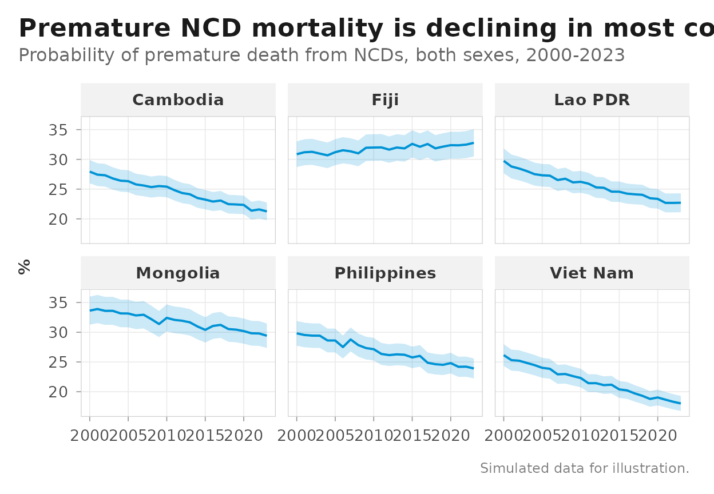
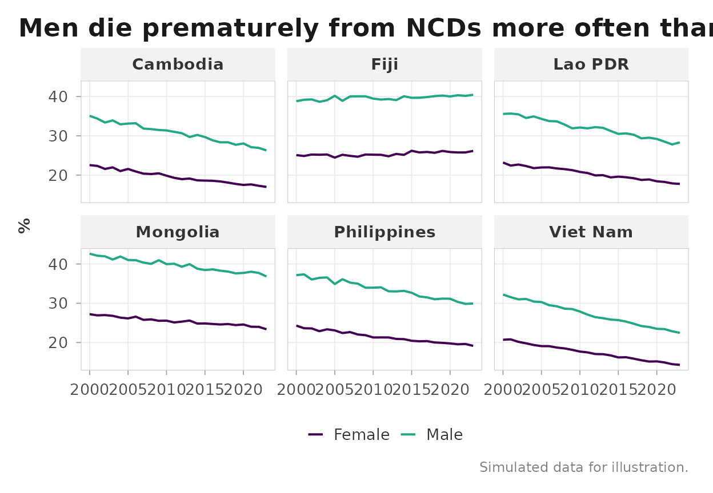
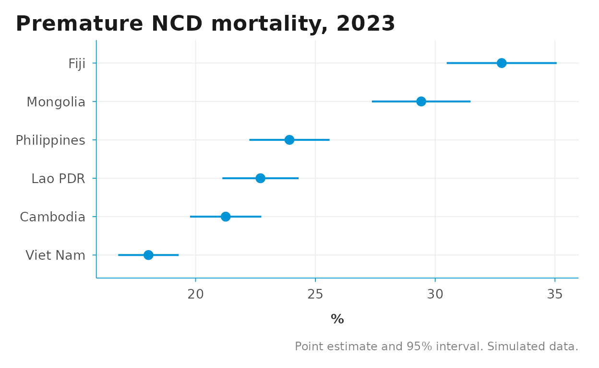
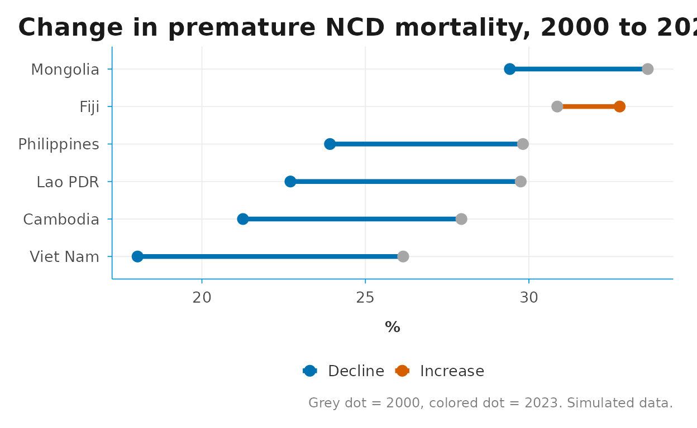

# Visualizing indicators

``` r

library(DSIR)
library(dplyr)
library(ggplot2)
```

[`gho_clean()`](https://shanlong-who.github.io/DSIR/reference/gho_clean.md)
and
[`sdg_clean()`](https://shanlong-who.github.io/DSIR/reference/sdg_clean.md)
return data in the same 15-column schema, so a handful of `ggplot2`
recipes cover most routine indicator charts. This vignette collects the
recipes we reach for most often: trend lines with confidence bands,
sex/age breakdowns, forest-style country comparisons, dumbbell progress
plots, and progress tracking with
[`aarr()`](https://shanlong-who.github.io/DSIR/reference/aarr.md).

Chart-building helpers stay out of the package on purpose — each recipe
below is a few lines of plain `ggplot2` on top of the cleaned schema,
and your project code can adapt them freely.

## Example data

The recipes need data in the cleaned schema. A real workflow would start
from the APIs:

``` r

ncd <- gho_data("NCDMORT3070", spatial_type = "country",
                area = c("PHL", "VNM", "KHM", "MNG", "FJI", "LAO")) |>
  gho_clean()
```

So that this vignette builds offline (and to keep the examples
reproducible), we simulate a small dataset with the same shape: an
NCD-mortality-style indicator for six Western Pacific countries,
2000–2023, with a sex breakdown in `dim1` and a confidence band in `low`
/ `high`.

``` r

set.seed(416)

countries <- who_countries |>
  filter(iso3 %in% c("PHL", "VNM", "KHM", "MNG", "FJI", "LAO")) |>
  select(iso3, location_name = name_short)

grid <- expand.grid(
  iso3 = countries$iso3,
  year = 2000:2023,
  dim1 = c("SEX_BTSX", "SEX_MLE", "SEX_FMLE"),
  stringsAsFactors = FALSE
) |>
  as_tibble()

base_rate <- c(PHL = 30, VNM = 26, KHM = 28, MNG = 34, FJI = 31, LAO = 29)
decline   <- c(PHL = 0.010, VNM = 0.016, KHM = 0.012,
               MNG = 0.006, FJI = -0.002, LAO = 0.011)
sex_shift <- c(SEX_BTSX = 1, SEX_MLE = 1.25, SEX_FMLE = 0.8)

ncd <- grid |>
  left_join(countries, by = "iso3") |>
  mutate(
    value_num = base_rate[iso3] * (1 - decline[iso3])^(year - 2000) *
      sex_shift[dim1] * exp(rnorm(n(), sd = 0.01)),
    low       = value_num * 0.93,
    high      = value_num * 1.07,
    source    = "gho",
    id        = "NCDMORT3070",
    indicator = "Probability of premature death from NCDs (%)",
    location  = iso3,
    year      = as.integer(year),
    value     = as.character(round(value_num, 1)),
    series    = NA_character_,
    dim2      = NA_character_,
    dim3      = NA_character_
  ) |>
  select(source, id, indicator, location, iso3, location_name, year,
         value, value_num, low, high, series, dim1, dim2, dim3)

ncd
#> # A tibble: 432 × 15
#>    source id        indicator location iso3  location_name  year value value_num
#>    <chr>  <chr>     <chr>     <chr>    <chr> <chr>         <int> <chr>     <dbl>
#>  1 gho    NCDMORT3… Probabil… KHM      KHM   Cambodia       2000 27.9       27.9
#>  2 gho    NCDMORT3… Probabil… FJI      FJI   Fiji           2000 30.9       30.9
#>  3 gho    NCDMORT3… Probabil… LAO      LAO   Lao PDR        2000 29.8       29.8
#>  4 gho    NCDMORT3… Probabil… MNG      MNG   Mongolia       2000 33.6       33.6
#>  5 gho    NCDMORT3… Probabil… PHL      PHL   Philippines    2000 29.8       29.8
#>  6 gho    NCDMORT3… Probabil… VNM      VNM   Viet Nam       2000 26.2       26.2
#>  7 gho    NCDMORT3… Probabil… KHM      KHM   Cambodia       2001 27.4       27.4
#>  8 gho    NCDMORT3… Probabil… FJI      FJI   Fiji           2001 31.2       31.2
#>  9 gho    NCDMORT3… Probabil… LAO      LAO   Lao PDR        2001 28.8       28.8
#> 10 gho    NCDMORT3… Probabil… MNG      MNG   Mongolia       2001 33.9       33.9
#> # ℹ 422 more rows
#> # ℹ 6 more variables: low <dbl>, high <dbl>, series <chr>, dim1 <chr>,
#> #   dim2 <chr>, dim3 <chr>
```

## Trend lines with a confidence band

`low` and `high` map directly onto
[`geom_ribbon()`](https://ggplot2.tidyverse.org/reference/geom_ribbon.html).
Filter to a single stratum first — here the both-sexes rows
(`dim1 == "SEX_BTSX"`).
[`theme_dsi_facet()`](https://shanlong-who.github.io/DSIR/reference/theme_dsi_facet.md)
is the facet-friendly variant of
[`theme_dsi()`](https://shanlong-who.github.io/DSIR/reference/theme_dsi.md).

``` r

ncd |>
  filter(dim1 == "SEX_BTSX") |>
  ggplot(aes(year, value_num)) +
  geom_ribbon(aes(ymin = low, ymax = high), fill = "#0093D5", alpha = 0.2) +
  geom_line(color = "#0093D5", linewidth = 0.7) +
  facet_wrap(~ location_name) +
  labs(
    title    = "Premature NCD mortality is declining in most countries",
    subtitle = "Probability of premature death from NCDs, both sexes, 2000-2023",
    x = NULL, y = "%",
    caption  = "Simulated data for illustration."
  ) +
  theme_dsi_facet()
```



## Breakdowns from `dim1` / `dim2` / `dim3`

GHO breakdowns (sex, age group, …) arrive in `dim1` / `dim2` / `dim3`.
Map the stratum to `colour` and keep palettes colorblind-safe —
[`scale_color_viridis_d()`](https://ggplot2.tidyverse.org/reference/scale_viridis.html)
ships with `ggplot2`.

``` r

ncd |>
  filter(dim1 %in% c("SEX_MLE", "SEX_FMLE")) |>
  ggplot(aes(year, value_num, color = dim1)) +
  geom_line(linewidth = 0.7) +
  facet_wrap(~ location_name) +
  scale_color_viridis_d(end = 0.6,
                        labels = c(SEX_FMLE = "Female", SEX_MLE = "Male")) +
  labs(
    title    = "Men die prematurely from NCDs more often than women",
    x = NULL, y = "%", color = NULL,
    caption  = "Simulated data for illustration."
  ) +
  theme_dsi_facet()
```



## Forest-style country comparison

To compare countries at a single point in time with their uncertainty
intervals, take the latest year per country and use
[`geom_pointrange()`](https://ggplot2.tidyverse.org/reference/geom_linerange.html).
Ordering the axis by value makes the ranking readable.

``` r

latest <- ncd |>
  filter(dim1 == "SEX_BTSX") |>
  slice_max(year, by = iso3)

ggplot(latest, aes(value_num, reorder(location_name, value_num))) +
  geom_pointrange(aes(xmin = low, xmax = high),
                  color = "#0093D5", linewidth = 0.7) +
  labs(
    title   = "Premature NCD mortality, 2023",
    x = "%", y = NULL,
    caption = "Point estimate and 95% interval. Simulated data."
  ) +
  theme_dsi()
```



## Dumbbell progress plot

A dumbbell plot compares two time points per country. Build the wide
shape with two filtered slices and a join — no reshaping package needed.
The colors are from the colorblind-safe Okabe-Ito palette.

``` r

start <- ncd |>
  filter(dim1 == "SEX_BTSX", year == 2000) |>
  select(location_name, start = value_num)
end <- ncd |>
  filter(dim1 == "SEX_BTSX", year == 2023) |>
  select(location_name, end = value_num)

dumbbell <- start |>
  left_join(end, by = "location_name") |>
  mutate(
    direction     = ifelse(end < start, "Decline", "Increase"),
    location_name = reorder(location_name, start)
  )

ggplot(dumbbell) +
  geom_segment(aes(x = start, xend = end,
                   y = location_name, yend = location_name,
                   color = direction),
               linewidth = 1.5) +
  geom_point(aes(start, location_name), size = 3, color = "grey65") +
  geom_point(aes(end, location_name, color = direction), size = 3) +
  scale_color_manual(values = c(Decline = "#0072B2", Increase = "#D55E00")) +
  labs(
    title   = "Change in premature NCD mortality, 2000 to 2023",
    x = "%", y = NULL, color = NULL,
    caption = "Grey dot = 2000, colored dot = 2023. Simulated data."
  ) +
  theme_dsi()
```



## Tracking progress with `aarr()`

[`aarr()`](https://shanlong-who.github.io/DSIR/reference/aarr.md)
computes the average annual rate of reduction — the standard WHO /
UNICEF progress metric. It slots directly into a grouped
[`summarise()`](https://dplyr.tidyverse.org/reference/summarise.html) on
the cleaned schema. Remember the sign convention: positive means the
indicator is declining.

``` r

progress <- ncd |>
  filter(dim1 == "SEX_BTSX") |>
  summarise(aarr = aarr(year, value_num), .by = c(iso3, location_name))

progress |>
  mutate(aarr_pct = round(100 * aarr, 1)) |>
  arrange(desc(aarr))
#> # A tibble: 6 × 4
#>   iso3  location_name     aarr aarr_pct
#>   <chr> <chr>            <dbl>    <dbl>
#> 1 VNM   Viet Nam       0.0159       1.6
#> 2 KHM   Cambodia       0.0117       1.2
#> 3 LAO   Lao PDR        0.0112       1.1
#> 4 PHL   Philippines    0.00995      1  
#> 5 MNG   Mongolia       0.00600      0.6
#> 6 FJI   Fiji          -0.00240     -0.2
```

A back-of-envelope projection carries the latest value forward at the
observed AARR. This is a quick screening device, not a substitute for
the indicator-specific models behind official 2030 projections.

``` r

latest |>
  left_join(progress, by = c("iso3", "location_name")) |>
  mutate(projected_2030 = value_num * (1 - aarr)^(2030 - year)) |>
  select(location_name, value_2023 = value_num, aarr, projected_2030) |>
  arrange(projected_2030)
#> # A tibble: 6 × 4
#>   location_name value_2023     aarr projected_2030
#>   <chr>              <dbl>    <dbl>          <dbl>
#> 1 Viet Nam            18.0  0.0159            16.1
#> 2 Cambodia            21.3  0.0117            19.6
#> 3 Lao PDR             22.7  0.0112            21.0
#> 4 Philippines         23.9  0.00995           22.3
#> 5 Mongolia            29.4  0.00600           28.2
#> 6 Fiji                32.8 -0.00240           33.3
```
